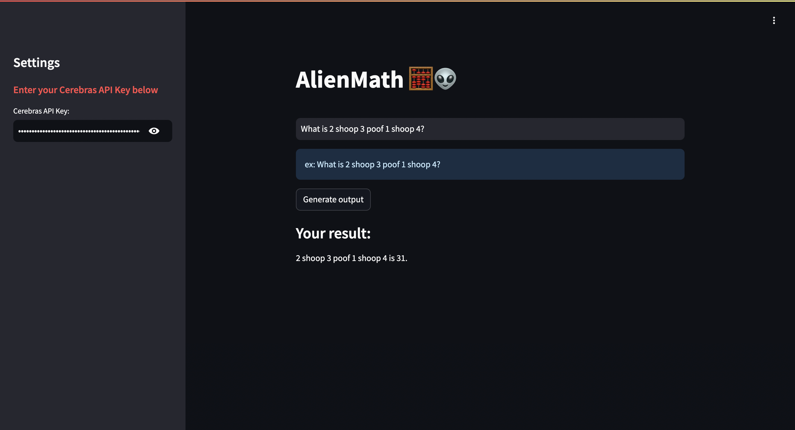

## "Alien" Agentic Workflows: LlamaIndex

This tutorial outlines the setup, code structure, and the implementation of a simple agentic workflow using Cerebras and LlamaIndex.



### Step 1: Set up your API Key

1. **Obtain Your API Key**: Log in to your Cerebras account, navigate to the “API Keys” section, and generate a new API key.

2. **Set the API Key in the Sidebar**: Once you have the Cerebras API key, add it to the sidebar on the left.

### Step 2: Install the Cerebras Inference Library

You need to install the Cerebras Inference library to interact with the API. Use the following command to install the library along with other dependencies:

```bash
pip install https://cerebras-cloud-sdk.s3.us-west-1.amazonaws.com/test/cerebras_cloud_sdk-0.5.0-py3-none-any.whl
pip install -r requirements.txt
```

### Step 3: Start your App

Run the command `streamlit run main.py` to start up the frontend.

---

https://docs.llamaindex.ai/en/stable/understanding/agent/basic_agent/

will have to implement custom LLM when product is ready: https://docs.llamaindex.ai/en/stable/module_guides/models/llms/usage_custom/