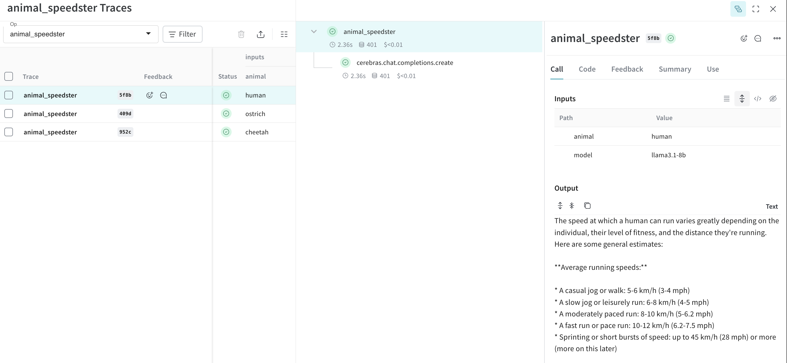

# Cerebras and Weights & Biases Weave

[]()

This project demonstrates how to use [Weights & Biases Weave](https://wandb.github.io/weave/) with the [Cerebras Cloud SDK](https://inference-docs.cerebras.ai/introduction) for automatic tracking and logging of LLM calls.

## Features

- Automatic tracing of Cerebras SDK calls
- Custom Weave ops for reproducible experiments
- `Model` class for organized experimentation
- Evaluations for scoring and comparing models

## Installation

1. Install Weave:
   ```
   pip install weave
   ```

2. Get your Weights & Biases API key from https://wandb.ai/authorize

3. Set up your Cerebras API key as an environment variable

## Usage

See the `trace_and_eval.ipynb` notebook for detailed examples of:

- Basic tracing with Weave
- Creating custom Weave ops
- Using the `Model` class for experimentation
- Creating evaluations and scoring them with Weave