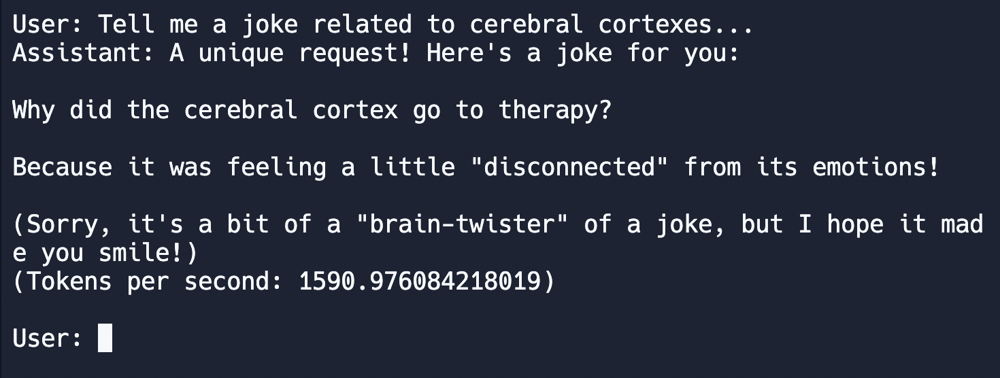

## Get Started with Cerebras API: Simple Chatbot

This guide will help you set up and use the Cerebras API to interact with generative AI models. You’ll learn how to configure your environment, install the necessary library, and get a simple chatbot running!



### What You'll Learn

- Setting up your developer environment
- Installing the Cerebras Inference library
- Running a simple chatbot script powered by Cerebras

### Step 1: Set up your API Key

1. **Obtain Your API Key**: Log in to your Cerebras account, navigate to the “API Keys” section, and generate a new API key.

2. **Set the API Key as an Environment Variable**: For security, store your API key as a secret in your repl! Here's [more information](https://docs.replit.com/replit-workspace/workspace-features/secrets) on how to do that.


   This ensures that your API key is available to your script without hardcoding it directly.

### Step 2: Install dependencies

Let's make sure we have all of the requirements for this project installed!
```bash
pip install -r requirements.txt
```

### Step 3: Start Chatting

With the API key set and the library installed, you’re ready to run the chatbot. This script will allow you to interact with the Cerebras API and process chat completions.

1. **API Key Initialization:**
   ```python
   client = Cerebras(api_key=os.environ.get("CEREBRAS_API_KEY"))
   ```
   The `Cerebras` client is initialized with an API key fetched from environment variables. This key is necessary for authenticating requests to the Cerebras API.

2. **User Input and Response Handling:**
   ```python
   user_input = input("User: ")
   user_message = {"role": "user", "content": user_input}
   ```
   User input is collected and formatted into a message object.

3. **Model Interaction:**
   ```python
   response = client.chat.completions.create(
       messages=[user_message],
       model="llama3.1-8b"
   )
   ```
   This API call sends the user message to the specified model (e.g., "llama3.1-8b") and retrieves the assistant’s response.

4. **Performance Metrics Calculation:**
   ```python
   total_tokens = response.usage.total_tokens
   total_time = response.time_info.total_time
   tokens_per_second = total_tokens / total_time
   ```
   After receiving the response, the total tokens used and the total processing time are extracted from the response object. Tokens per second are then calculated by dividing the total tokens by the total time.