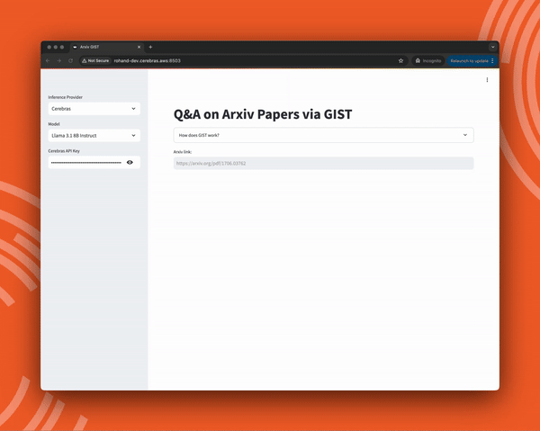

# ReadAgent for Arxiv Papers

## Overview

  

This project implements Google DeepMind’s ReadAgent using the Cerebras Inference SDK. It leverages the ReadAgent workflow to enable users to interactively chat with Arxiv papers.

ReadAgent is an AI agent designed to enhance the capabilities of Large Language Models (LLMs) in processing and understanding long contexts through a method called memory gisting. Inspired by human reading patterns, ReadAgent employs a novel approach centered around the concept of “gist memories” to break down, summarize, and intelligently retrieve information from lengthy texts, such as books or extensive documents.

For a detailed description of ReadAgent’s workflow, please refer to our [blog post](https://cerebras.ai/blog/readagent-bringing-gist-memory-to-ai) and the [original paper](https://arxiv.org/abs/2402.09727) by Google DeepMind. You can also see our demo of ReadAgent [here](https://gist-app.replit.app/). To obtain a Cereberas Inference SDK API key, please visit our [QuickStart guide](https://inference-docs.cerebras.ai/quickstart). 

ReadAgent's workflow involves multiple prompts to the LLM at each step to create pages, generate summaries, and retrieve relevant information. As a result, the efficiency of ReadAgent heavily depends on a low-latency LLM inference solution, like the one provided by Cerebras.

## Project Structure

- `app.py`: Entry point of the application
- `gist.py`: Core logic of ReadAgent
- `arxiv_parser.py`: Handles processing of papers from Arxiv
- `streamlit_helper.py`: Handles UI rendering with Streamlit

## Setup & Usage

- Clone the repository
- Install the requirements `pip install -r requirements.txt`
- See the Cerebras SDK [QuickStart guide](https://inference-docs.cerebras.ai/quickstart) for configuring your API key
- Run the app `streamlit run app.py`

## References

K.-H. Lee, X. Chen, H. Furuta, J. Canny, and I. Fischer, “A humaninspired reading agent with gist memory of very long contexts,” arXiv preprint arXiv:2402.09727, 2024.
