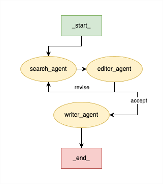
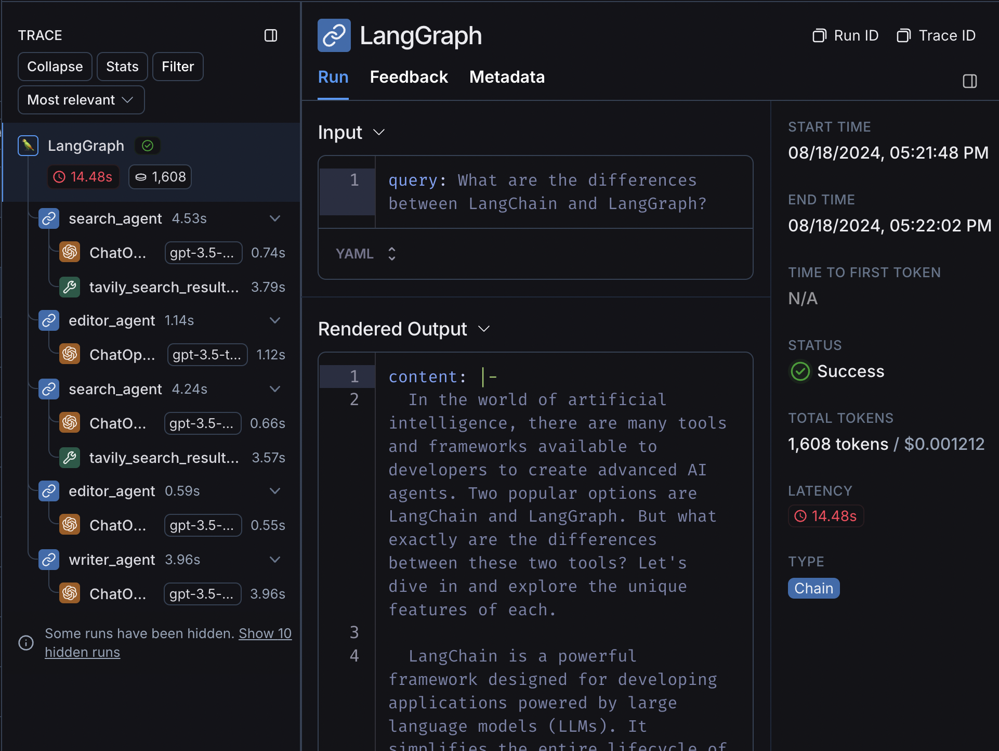

## Three's the Charm: Multi Agentic Workflow with LangChain and LangGraph

This tutorial outlines how to build a three-agent workflow (researcher, editor, and writer) that produces a blog utilizing LangChain, LangGraph, and the Cererbras API.

<!--  -->

### Step 1: Set up your API Keys

1. **Obtain Your API Keys**:
* Log in to your Cerebras account, navigate to the “API Keys” section, and generate a new API key.
* Do the same with the [Tavily API](https://app.tavily.com/home).
* Finally, log in to your [LangChain account](https://smith.langchain.com) and click on the settings cog in the bottom left corner to generate a new API key.

2. **Set the API Keys in the Sidebar**: Once you have the Cerebras, Tavily, & LangChain API keys, add them to the sidebar on the left.

### Step 2: Install the Cerebras Inference Library

You need to install the Cerebras Inference library to interact with the API. Use the following command to install the library along with other dependencies:

```bash
pip install https://cerebras-cloud-sdk.s3.us-west-1.amazonaws.com/test/cerebras_cloud_sdk-0.5.0-py3-none-any.whl
pip install -r requirements.txt
```

### Step 3: Start writing blogs

Run the command `streamlit run main.py` to start up the frontend.

### Code Overview
What does a multi-agent workflow look like? In our case, our blog-writing team will consist of three agents: the `search_agent` (Researcher), `editor_agent` (Editor), and `writer_agent` (Writer). The researcher utilizes the Tavily API to gather search results from the internet, which are then accepted or sent back for revision by the editor. Finally, the approved research results are sent to the writer to complete the blog.



#### Setting Up the Streamlit Interface

We start by creating a simple Streamlit app to gather user input and display the results.

```python
import os
import time
import streamlit as st
from langgraph.graph import StateGraph
from langgraph.graph.message import add_messages
from typing_extensions import TypedDict
from typing import Annotated
from langgraph.graph import END
from langchain_community.tools.tavily_search import TavilySearchResults
from langchain_openai import ChatOpenAI

# Add tracing in LangSmith
os.environ["LANGCHAIN_TRACING_V2"] = "true"

# Start of Streamlit Application
st.title("A Three Person Job: Blog Writing with Multi-Agent Workflow ✏️")

final_result = []

# Load secrets
with st.sidebar:
    st.title("Settings")
    st.markdown("### :red[Enter your Cerebras API Key below]")
    api_key = st.text_input("Cerebras API Key:", type="password")
    st.markdown("### :red[Enter your Tavily API Key below]")
    os.environ["TAVILY_API_KEY"] = st.text_input("Tavily API Key:", type="password")
    st.markdown("### :red[Enter your LangChain API Key below]")
    os.environ["LANGCHAIN_API_KEY"] = st.text_input("LangChain API Key:", type="password")

if not api_key or not os.environ.get("TAVILY_API_KEY") or not os.environ.get("LANGCHAIN_API_KEY"):
    st.markdown("""
    ## Welcome to Cerebras x LangChain & LangGraph Agentic Workflow Demo!

    A researcher, editor, and writer walk into a bar. Except, this bar is an agentic workflow. This demo showcases a multi-agent workflow for generating a blog post based on a query.

    To get started:
    1. :red[Enter your Cerebras and Tavily API Keys in the sidebar.]
    2. Ask the bot to write a blog about a topic.
    3. The bot will search for information, evaluate it, and write a blog post.

    """)
    st.info("ex: What are the differences between LangChain and LangGraph?")
    st.stop()
```

#### Defining the State and Agents

We define the state and agents in our system using classes. The state represents the current stage and data in the workflow, while the agents perform specific tasks.

**State Definition**

```python
class State(TypedDict):
    query: Annotated[list, add_messages]
    research: Annotated[list, add_messages]
    content: str
    content_ready: bool
    iteration_count: int
```

**Research Agent**

The `ResearchAgent` is responsible for optimizing the search query and retrieving relevant results.

```python
class ResearchAgent:
    def format_search(self, query: str) -> str:
        prompt = (
            "You are an expert at optimizing search queries for Google. "
            "Your task is to take a given query and return an optimized version of it, making it more likely to yield relevant results. "
            "Do not include any explanations or extra text, only the optimized query.\n\n"
            "Example:\n"
            "Original: best laptop 2023 for programming\n"
            "Optimized: top laptops 2023 for coding\n\n"
            "Now optimize the following query:\n"
            f"Original: {query}\n"
            "Optimized:"
        )
        
        response = llm.invoke(prompt)  
        return response.content
    
    def search(self, state: State):
        search = TavilySearchResults(max_results=1)
        start_time = time.perf_counter()
        optimized_query = self.format_search(state.get('query', "")[-1].content)
        end_time = time.perf_counter()
        results = search.invoke(optimized_query)
        state["optimized_query"] = optimized_query
        final_result.append({"subheader": f"Research Iteration", "content": [results[0]["content"]], "time": end_time - start_time})
        return {"research": [results[0]["content"]]}
```

**Editor Agent**

The `EditorAgent` evaluates the gathered research and decides whether the information is sufficient or needs further refinement.

```python
class EditorAgent:
    def evaluate_research(self, state: State):
        query = '\n'.join(message.content for message in state.get("query"))
        research = '\n'.join(message.content for message in state.get("research"))

        iteration_count = state.get("iteration_count", 1)
        
        if iteration_count is None:
            iteration_count = 1
        
        if iteration_count >= 3:
            return {"content_ready": True}
        
        prompt = (
            "You are an expert editor. Your task is to evaluate the research based on the query. "
            "If the information is sufficient to create a comprehensive and accurate blog post, respond with 'sufficient'. "
            "If the information is not sufficient, respond with 'insufficient' and provide a new, creative query suggestion to improve the results. "
            "Consider the depth, relevance, and completeness of the information when making your decision.\n\n"
            "Now evaluate the following:\n"
            f"Used queries: {query}\n"
            f"Research: {research}\n\n"
            "Evaluation (sufficient/insufficient):\n"
            "New query (if insufficient):"
        )
        
        start_time = time.perf_counter()
        response = llm.invoke(prompt)
        end_time = time.perf_counter()

        evaluation = response.content.strip()
        final_result.append({"subheader": f"Editor Evaluation Iteration", "content": evaluation, "time": end_time - start_time})

        if "new query:" in evaluation.lower():
            new_query = evaluation.split("New query:", 1)[-1].strip()
            return {"query": [new_query], "iteration_count": iteration_count + 1, "evaluation": evaluation}
        else:
            return {"content_ready": True, "evaluation": evaluation}
```

**Writer Agent**

The `WriterAgent` writes the final blog post based on the user's query and approved research results by the editor.

```python
class WriterAgent:
    def write_blogpost(self, state: State):
        query = state.get("query")[0].content
        research = '\n'.join(message.content for message in state.get("research"))

        prompt = (
            "You are an expert blog post writer. Your task is to take a given query and context, and write a comprehensive, engaging, and informative short blog post about it. "
            "Make sure to include an introduction, main body with detailed information, and a conclusion. Use a friendly and accessible tone, and ensure the content is well-structured and easy to read.\n\n"
            f"Query: {query}\n\n"
            f"Context:\n{research}\n\n"
            "Write a detailed and engaging blog post based on the above query and context."
        )

        response  = llm.invoke(prompt)
        return {"content": response.content}
```

### Setting Up the StateGraph

The `StateGraph` orchestrates the interactions between agents, defining how data flows and how decisions are made. As you can see in the code below, the `accept` and `revise` values from the `content_ready` state dictate whether to continue to the writing stage.

```python
graph = StateGraph(State)
graph.add_node("search_agent", ResearchAgent().search)
graph.add_node("writer_agent", WriterAgent().write_blogpost)
graph.add_node("editor_agent", EditorAgent().evaluate_research)

graph.set_entry_point("search_agent")
graph.add_edge("search_agent", "editor_agent")
graph.add_conditional_edges(
    "editor_agent",
    lambda state: "accept" if state.get("content_ready") else "revise",
    {
        "accept": "writer_agent",
        "revise": "search_agent"
    }
)
graph.add_edge("writer_agent", END)
graph = graph.compile()
```

### Running the Workflow

Finally, we use Streamlit to create a user interface where users can input their query and trigger the workflow.

```python
user_input = st.text_input("")
st.info("ex: What are the differences between LangChain and LangGraph?")

if st.button("Generate output"):
    if user_input:
        with st.spinner("Generating blog post..."):
            start_time = time.perf_counter()
            blogpost = graph.invoke({"query": user_input})
            end_time = time.perf_counter()

        # Display intermediate steps
        st.subheader
```

### LangSmith
Since LangChain tracing has been enabled in this program, you can also view the workflow on [LangSmith](https://smith.langchain.com/). LangSmith provides a clearer visualization of the conditional logic required to complete the workflow.

