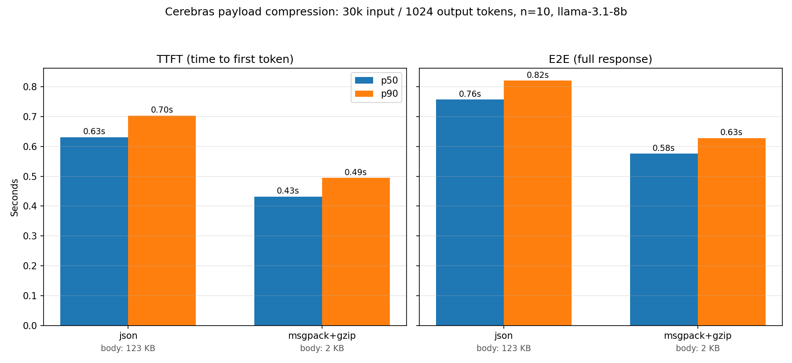

# Payload Compression (msgpack + gzip)

Cerebras Inference accepts compressed request bodies on `/v1/chat/completions` and `/v1/completions`. For large prompts (e.g. long conversations, RAG context, code-review workloads) this shrinks the request dramatically — which cuts the network transfer time and therefore **TTFT** (time to first token) and **E2E** (end-to-end) latency.

This example focuses on the strongest combination — **msgpack (inner) + gzip (outer)** — and shows:

1. [simple_example.py](./simple_example.py) — the minimal code to send a compressed request.
2. [benchmark.py](./benchmark.py) — a benchmark that measures TTFT and E2E across 10 runs × 2 encodings on a ~30k-token coding-review prompt.
3. [Results](#3-results) — the chart and table produced by executing `benchmark.py` with an example model

The API also supports msgpack alone and gzip alone; the Cerebras [payload-optimization docs](https://inference-docs.cerebras.ai/capabilities/payload-optimization) cover those. msgpack+gzip gives the best reduction, so that's what this example uses.

## 1. Minimal usage

Three things differ from a plain-JSON request:

- **Body** is `gzip.compress(msgpack.packb(payload))` (msgpack must be inside, gzip outside. Order is not swappable.)
- **`Content-Type: application/vnd.msgpack`** (tells the server the decompressed body is msgpack).
- **`Content-Encoding: gzip`** (tells the server to decompress before parsing).

Here's example code using `gpt-oss-120b` model, you can swap the model to any other supported model. 
```python
import gzip, json, os, httpx, msgpack

api_key = os.environ["CEREBRAS_API_KEY"]
payload = {
    "model": "gpt-oss-120b",
    "messages": [{"role": "user", "content": "Explain payload compression in one sentence."}],
    "max_tokens": 1024,
}

body = gzip.compress(msgpack.packb(payload))
headers = {
    "Authorization": f"Bearer {api_key}",
    "Content-Type": "application/vnd.msgpack",
    "Content-Encoding": "gzip",
}

r = httpx.post("https://api.cerebras.ai/v1/chat/completions",
               content=body, headers=headers, timeout=60.0)
r.raise_for_status()
print(r.json()["choices"][0]["message"]["content"])
```

On a trivially small payload like this you'll see something like `Sent 210 compressed bytes (vs 195 plain JSON — -7.7% smaller)`: compression can actually *grow* sub-KB payloads. That's expected. The point of the feature is large payloads — see the benchmark.

## 2. Benchmark methodology

- **Model**: This benchmark uses `llama-3.1-8b`, a simple and small model, for demonstration purposes. You can swap this model to any other supported model.
- **Prompt**: one deterministic ~30k token user message built by repeating a realistic Python code block and appending a specific review question. Byte-identical across all runs — see the note on KV cache below. (30k chosen to stay well under `llama-3.1-8b`'s 32k context window.)
- **Response**: `max_tokens=1024`, streaming (`stream: true`), so we can measure both TTFT and an end-to-end latency that reflects a realistic generation length.
- **Encodings**: `json` (baseline) and `msgpack+gzip`.
- **Runs**: 1 warmup (discarded) + 10 measured runs per encoding.
- **Metrics**: TTFT (request sent → first content token received) and E2E (request sent → stream ends). Reported as p50, p90, and average.
- **Rate limits**: the script retries on HTTP 429 (Tokens-Per-Minute limit) honoring the `Retry-After` header — this can extend total runtime.

### KV cache note

We use the **same prompt bytes** for every run. After the warmup request, the Cerebras server's prompt KV cache is warm, and every subsequent run (in both encodings) reuses it. That's intentional: it isolates the variable this example is measuring (wire-format transfer + server-side decompression) from prompt-processing cost, so the reported TTFT/E2E deltas reflect network savings, not token-generation differences.

If you want to measure a cold-cache scenario, vary the prompt across runs (e.g., append a unique sentinel) — but expect wider variance.

## 3. Results



| Encoding | Bytes Sent | TTFT p50 | TTFT p90 | TTFT avg | E2E p50 | E2E p90 | E2E avg |
|---|---|---|---|---|---|---|---|
| json | 123.4 KB | 0.63s | 0.70s | 0.63s | 0.76s | 0.82s | 0.76s |
| msgpack+gzip | 2.0 KB | 0.43s | 0.49s | 0.45s | 0.58s | 0.63s | 0.59s |

On this run (`llama-3.1-8b`, 30k-token input, `max_tokens=1024`, 10 measured runs per encoding):

- **Body size**: 123.4 KB → 2.0 KB — **98.4% smaller**.
- **TTFT p50**: 0.63s → 0.43s — **~32% faster** to the first token.
- **TTFT p90**: 0.70s → 0.49s — **~30% faster** at the tail.
- **E2E p50**: 0.76s → 0.58s — **~24% faster** end-to-end.
- **E2E p90**: 0.82s → 0.63s — **~23% faster** at the E2E tail.

p50 and p90 are close together for each encoding, which says the 10-run sample is stable. The gain is consistent: roughly a **third** off TTFT and a **quarter** off E2E, on every percentile, for essentially zero cost.

Absolute numbers depend on your network path to Cerebras — run it yourself to see what you get. The **shape** of the result (compressed is faster and more stable) reliably holds on any link where the plain-JSON upload takes a meaningful fraction of the total request time.

## Run it

```bash
cd payload-compression
python3 -m venv .venv && source .venv/bin/activate
pip install -r requirements.txt
export CEREBRAS_API_KEY=sk-...

# Part 1: one compressed request, ~1 second
python simple_example.py

# Part 2: full benchmark, ~10-15 min depending on TPM limits
python benchmark.py
```

`benchmark.py` writes `results.png` in place and prints a markdown table of the stats to stdout.

## Caveats

- **Network variance**: benchmarking real API calls is inherently noisy. We mitigate with a warmup + 10 runs + reporting p50 and p90, not just averages.
- **Region / link**: TTFT improvements from payload compression scale with upload time, which depends on your upstream bandwidth and round-trip to Cerebras. Fast local networks see smaller absolute wins than constrained ones.
- **Sub-KB payloads**: compression overhead can exceed savings. The feature is for large prompts (long context, RAG, code review).
- **TPM quota**: large prompts consume significant tokens per request. The benchmark honors HTTP 429 `Retry-After` headers and can take longer than the raw request time suggests.
