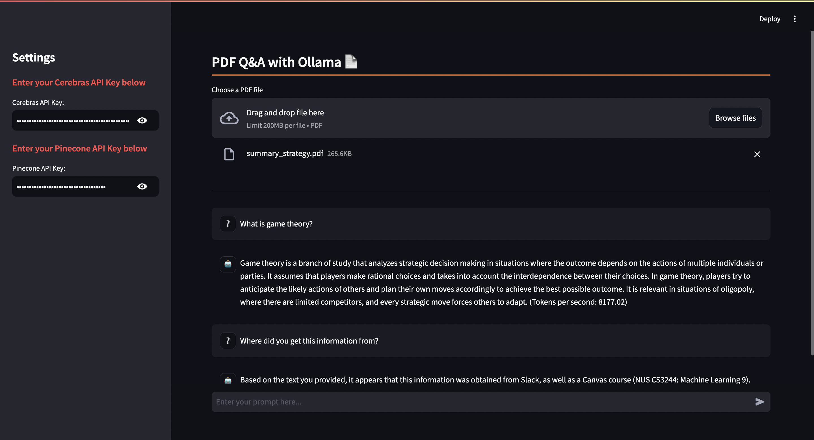

## PDF Q&A: RAG with Cerebras, Pinecone, and Ollama

Creating a system to answer questions based on PDF content involves integrating various technologies for text processing, vector storage, and language model responses. This tutorial outlines the setup, code structure, and how RAG works integrated with Pinecone as a vector storage system and Ollama as an embedding model to build such a system.



### Step 1: Set up your API Keys

1. **Obtain Your API Keys**: Log in to your Cerebras account, navigate to the “API Keys” section, and generate a new API key. Log in to your Pinecone account, navigate to "API keys," and keep record of it.

2. **Set the API Keys in the Sidebar**: Once you have both Cerebras and Pinecone API Keys, add them to the sidebar on the left.

### Step 2: Install dependencies

Let's make sure we have all of the requirements for this project installed!
```bash
pip install -r requirements.txt
```

### Step 3: Start Q&A with your PDF

We can run Ollama by pulling a docker image and pulling `nomic-embed-text`, the embedding model we will be using.
```bash
docker run -d -v ollama:/root/.ollama -p 11434:11434 --name ollama ollama/ollama
docker exec -it ollama ollama pull nomic-embed-text
```

Finally, run the command `streamlit run main.py` to start up the frontend.

### **Code Structure**
Our code has four major components to make this system work.

1. **Embeddings and Vector Storage**

    Embeddings are generated using Ollama; the `upload_vectors` function uploads text chunks to Pinecone after converting them into vectors.

    ```python
    from langchain_community.embeddings import OllamaEmbeddings

    # Create embeddings
    # Create embeddings
    embeddings = OllamaEmbeddings(model="nomic-embed-text")
    ```
   
    ```python
    from langchain_weaviate import WeaviateVectorStore

    # Upload vectors to Weaviate
    vector_store = PineconeVectorStore(index_name="python-index", embedding=embeddings)
    for i in range(len(texts)):
        t = texts[i]
        vector_store.add_texts([t.page_content])
        progress_bar.progress((i + 1) / len(texts), "Indexing PDF content... (this may take a bit) 🦙")
    ```

2. **Generating a Response**

    Using the user's prompt and similar text chunks based on their search query, generate an answer.

    ```python
    # Perform similarity search
    docs = st.session_state.docsearch.similarity_search(prompt)

    # Load the question answering chain
    llm = ChatCerebras(api_key=CEREBRAS_API_KEY, model="llama3.1-8b")
    chain = load_qa_chain(llm, chain_type="stuff")

    # Query the documents and get the answer
    response = chain.run(input_documents=docs, question=prompt)
    ```

### Diving Deeper into Retrieval-Augmented Generation (RAG) with Pinecone

Retrieval-Augmented Generation (RAG) is a technique that combines the strengths of information retrieval and text generation models. Think about some exams you had to do earlier in your schooling: you couldn't answer all the questions without a background article provided by your teacher. That's what we're doing - providing background information to the LLM so it can answer questions about it.

#### Initialization

We can create a Pinecone client using the user's API key and create an index if it does not yet exist.
```python
# Create a Pinecone index and add the documents to it
pc = Pinecone()

# Create the index if it does not exist
if index_name not in pc.list_indexes().names():
    with st.spinner(text="Creating Pinecone index..."):
        pc.create_index(
            name=index_name, 
            dimension=768, # output dimension of nomic-embed-text
            metric="cosine",
            spec=ServerlessSpec(
                cloud='aws', 
                region='us-east-1'
            )
)
```

#### Document Retrieval and Indexing
* **Text Chunking:** The PDF content is split into smaller chunks using `RecursiveCharacterTextSplitter`.
```python
from langchain.document_loaders import PyPDFLoader
from langchain.text_splitter import RecursiveCharacterTextSplitter

loader = PyPDFLoader(temp_filepath)
data = loader.load()

# Split the data into smaller documents
text_splitter = RecursiveCharacterTextSplitter(chunk_size=1000, chunk_overlap=0)
texts = text_splitter.split_documents(data)
```
* **Vectorization:** Each text chunk is converted into a vector representation using OllamaEmbeddings.
* **Pinecone:** These vectors are then stored in Pinecone, which is optimized for similarity search. Pinecone handles the vector data and supports efficient nearest-neighbor searches.
```python
from langchain_community.embeddings import OllamaEmbeddings
from langchain_pinecone import PineconeVectorStore

# Convert text to vectors
embeddings = OllamaEmbeddings(model="nomic-embed-text")

vector_store = PineconeVectorStore(index_name=index_name, embedding=embeddings)
for i in range(len(texts)):
    t = texts[i]
    vector_store.add_texts([t.page_content])
    progress_bar.progress((i + 1) / len(texts), "Indexing PDF content... (this may take a bit) 🦙")
```

#### Query Processing
* **Similarity Search:** Pinecone performs a similarity search to retrieve the most relevant text chunks based on the user's query.
```python
# Perform similarity search
docs = st.session_state.docsearch.similarity_search(prompt)
```

* **Answer Generation**: Based on the most relevant text chunks found from the similarity search and the user's query, return an answer generated by Cerebras's output.
```python
from langchain.chains.question_answering import load_qa_chain

# Load question answering chain
llm = ChatCerebras(api_key=CEREBRAS_API_KEY, model="llama3.1-8b")
chain = load_qa_chain(llm, chain_type="stuff")

# Generate answer
response = chain.run(input_documents=docs, question=prompt)
```