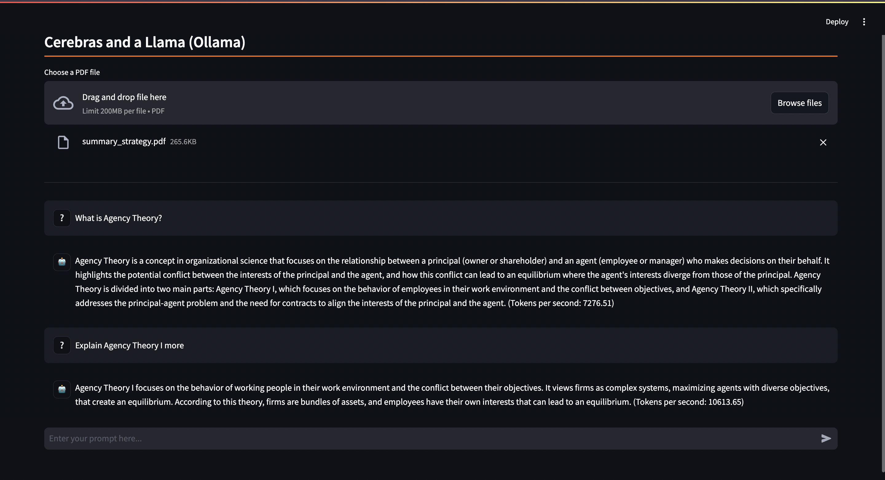

## RAG with Cerebras and Ollama

This tutorial outlines the setup, code structure, and how RAG works integrated with Pinecone as a vector storage system and Ollama as an embedding model.



### Step 1: Set up your API Keys

1. **Obtain Your API Keys**: Log in to your Cerebras account, navigate to the “API Keys” section, and generate a new API key. Log in to your Pinecone account, navigate to "API keys," and keep record of it.

2. **Set the API Keys as an Environment Variables**: Run the following command in your terminal to set your secrets

```bash
export CEREBRAS_API_KEY=[replace with your api key]
export PINECONE_API_KEY=[replace with your api key]
```

### Step 2: Install the Cerebras Inference Library

You need to install the Cerebras Inference library to interact with the API. Use the following command to install the library along with other dependencies:

```bash
pip install https://cerebras-cloud-sdk.s3.us-west-1.amazonaws.com/test/cerebras_cloud_sdk-0.5.0-py3-none-any.whl
pip install -r requirements.txt
```

### Step 3: Starting Ollama

We can run Ollama by pulling a docker image and pulling `nomic-embed-text`, the embedding model we will be using.
```bash
docker run -d -v ollama:/root/.ollama -p 11434:11434 --name ollama ollama/ollama
docker exec -it ollama ollama pull nomic-embed-text
```

Finally, run the command `streamlit run main.py` to start up the frontend.

---
https://www.youtube.com/watch?v=TMaQt8rN5bE
https://github.com/sudarshan-koirala/rag-chat-with-pdf/blob/main/app.py

https://ollama.com/blog/embedding-models

https://github.com/rubentak/Langchain/blob/main/notebooks/langchain_pinecone.ipynb

https://hub.docker.com/r/ollama/ollama

https://ollama.com/library/nomic-embed-text
