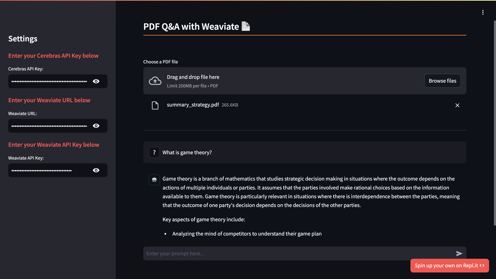

## PDF Q&A (Pt. 2): RAG with Weaviate

Creating a system to answer questions based on PDF content involves integrating various technologies for text processing, vector storage, and language model responses. This tutorial outlines the setup, code structure, and how RAG works integrated with Weaviate as a vector storage system.



### Step 1: Set up your API Keys

1. **Obtain Your API Keys**: Log in to your Cerebras account, navigate to the “API Keys” section, and generate a new API key. Log in to your Weaviate account, create a new cluster, and take note of the API key and the cluster URL.

2. **Set the API Keys in the Sidebar**: Once you have both Cerebras and Weaviate API Keys and URL, add them to the sidebar on the left.

### Step 2: Install the Cerebras Inference Library

You need to install the Cerebras Inference library to interact with the API. Use the following command to install the library along with other dependencies:

```bash
pip install -r requirements.txt
```

### Step 3: Start Q&A with your PDF

Run the command `streamlit run main.py` to start up the frontend.

### **Code Structure**
Our code has four major components to make this system work.

1. **Custom LLM Implementation**
    LangChain currently doesn't have a Cerebras method, but we can create our own using this [handy tutorial](https://python.langchain.com/v0.1/docs/modules/model_io/llms/custom_llm/).

    **CerebrasLLM Class**: This class enables the implementation of Cerebras's LLM with LangChain. It can be called like so: `CerebrasLLM(api_key=api_key, model_name=model_name)`

    ```python
    class CerebrasLLM(LLM):
    """A custom LLM implementation for the Cerebras API."""

        api_key: str
        model_name: str

        # Class continues
    ```

2. **Embeddings and Vector Storage**

    Embeddings are generated using LangChain's `SentenceTransformerEmbeddings`; the `upload_vectors` function uploads text chunks to Weaviate after converting them into vectors.

    ```python
    from langchain_community.embeddings.sentence_transformer import SentenceTransformerEmbeddings

    # Create embeddings
    with st.spinner(text="Loading embeddings..."):
        embeddings = SentenceTransformerEmbeddings(model_name="all-MiniLM-L6-v2")
    ```
   
    ```python
    from langchain_weaviate import WeaviateVectorStore

    # Upload vectors to Weaviate
    vector_store = WeaviateVectorStore(client=client, index_name="my_class", text_key="text", embedding=embeddings)
    for i in range(len(texts)):
        t = texts[i]
        vector_store.add_texts([t.page_content])
        progress_bar.progress((i + 1) / len(texts), "Indexing PDF content... (this may take a bit) 🦙")
    ```

4. **Generating a Response**

    Using the user's prompt and similar text chunks based on their search query, generate an answer.

    ```python
    # Perform similarity search
    docs = st.session_state.docsearch.similarity_search(prompt)

    # Load the question answering chain
    llm = CerebrasLLM(api_key=CEREBRAS_API_KEY, model_name="llama3.1-8b")
    chain = load_qa_chain(llm, chain_type="stuff")

    # Query the documents and get the answer
    response = chain.run(input_documents=docs, question=prompt)
    ```

### Diving Deeper into Retrieval-Augmented Generation (RAG) with Weaviate

Retrieval-Augmented Generation (RAG) is a technique that combines the strengths of information retrieval and text generation models. Think about some exams you had to do earlier in your schooling: you couldn't answer all the questions without a background article provided by your teacher. That's what we're doing - providing background information to the LLM so it can answer questions about it.

**Initialization**

We can create a Weaviate client using the user's API key and their cluster's URL.
```python
# Create a Weaviate client
client = weaviate.connect_to_weaviate_cloud(
    cluster_url=WEAVIATE_URL,  # Replace with your Weaviate Cloud URL
    auth_credentials=weaviate.AuthApiKey(WEAVIATE_API_KEY),
)
```

**Document Retrieval and Indexing**
* **Text Chunking:** The PDF content is split into smaller chunks using `RecursiveCharacterTextSplitter`.
```python
from langchain.document_loaders import PyPDFLoader
from langchain.text_splitter import RecursiveCharacterTextSplitter

loader = PyPDFLoader(temp_filepath)
data = loader.load()

# Split the data into smaller documents
text_splitter = RecursiveCharacterTextSplitter(chunk_size=1000, chunk_overlap=0)
texts = text_splitter.split_documents(data)
```
* **Vectorization:** Each text chunk is converted into a vector representation using OllamaEmbeddings.
  ```python
  from langchain_community.embeddings.sentence_transformer import SentenceTransformerEmbeddings

  # Create embeddings
  with st.spinner(text="Loading embeddings..."):
      embeddings = SentenceTransformerEmbeddings(model_name="all-MiniLM-L6-v2")
  ```
 * **Weaviate:** These vectors are then stored in Weaviate, which is an open source vector database. It's optimized for similarity search, which allows us to identify text chunks our LLM needs to answer the user's prompt.
  ```python
  from langchain_weaviate import WeaviateVectorStore

  # Upload vectors to Weaviate
  vector_store = WeaviateVectorStore(client=client, index_name="my_class", text_key="text", embedding=embeddings)
  for i in range(len(texts)):
      t = texts[i]
      vector_store.add_texts([t.page_content])
      progress_bar.progress((i + 1) / len(texts), "Indexing PDF content... (this may take a bit) 🦙")
  ```

**Query Processing**
* **Similarity Search:** Weaviate performs a similarity search to retrieve the most relevant text chunks based on the user's query.
```python
# Perform similarity search
docs = st.session_state.docsearch.similarity_search(prompt)
```

* **Answer Generation**: Based on the most relevant text chunks found from the similarity search and the user's query, return an answer generated by Cerebras's output.
```python
from langchain.chains.question_answering import load_qa_chain

# Load question answering chain
llm = CerebrasLLM(api_key=CEREBRAS_API_KEY, model_name="llama3.1-8b")
chain = load_qa_chain(llm, chain_type="stuff")

# Generate answer
response = chain.run(input_documents=docs, question=prompt)
```